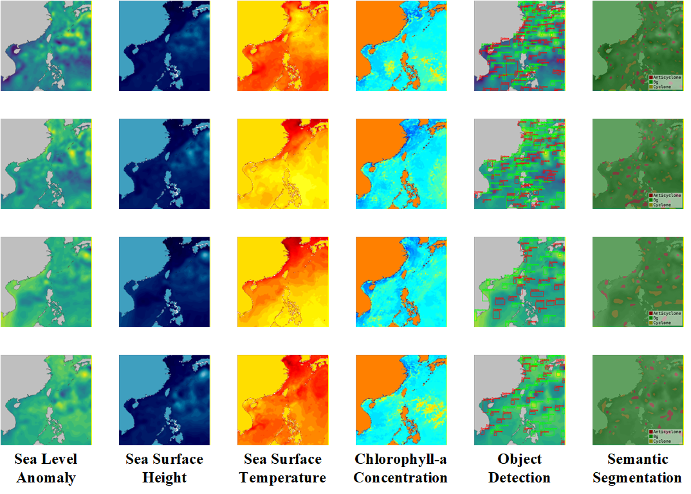
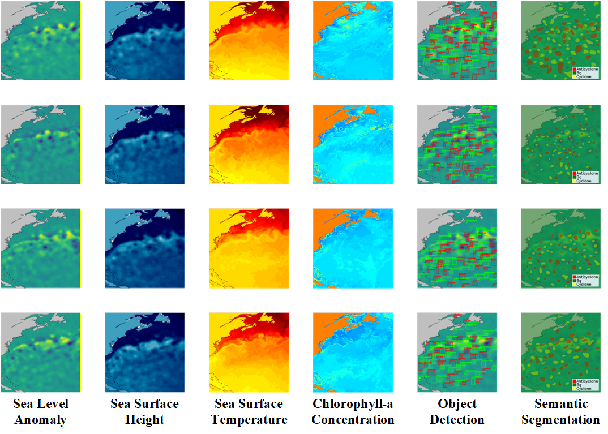

# Mesoscale-Eddy-Dataset

We constructed a benchmark dataset for **mesoscale eddy detection** that integrates multimodal data. Specifically, the dataset combines **sea level anomaly (SLA)**, **sea surface height (SSH)**, **sea surface temperature (SST)** and **chlorophyll-a (CHL) concentration**, thereby providing complementary information for eddy detection. Overall, the dataset comprises **341,500** mesoscale eddies, including **173,651** anticyclone eddies and **167,849** cyclone eddies.

## Data Specifications

* **Spatiotemporal Resolution**: The multimodal data have a spatial resolution of **0.25° × 0.25°** and a daily temporal resolution.

* **Temporal Coverage**: Each dataset covers **2,000** consecutive days.

* **Dimensions**: The original data dimensions of 129 × 129 pixels have been upsampled by a factor of five to a final resolution of **645 × 645** pixels.

## Study Areas

* **Area-A** covers the region bounded by **5°N-37°N** and **104°E-136°E**, and is further divided into two subregions: **Area-A1** and **Area-A2**.

* **Area-B** covers the region bounded by **19°N-51°N** and **47°W-79°W**.

| Ocean     | Spatial coverage      | Temporal coverage     |
| ---       | ---                   | ---                   |
| Area-A    | 5°-37°N, 104°-136°E   | 2016.8.19-2022.2.9    |
| Area-A1   | 5°-23°N, 105°-121°E   | 2016.8.19-2022.2.9    |
| Area-A2   | 23°-34°N, 117°-131°E  | 2016.8.19-2022.2.9    |
| Area-B    | 19°-51°N, 47°-79°W    | 2017.12.16-2023.6.7   |

Each region in the dataset contains **2,000** images in total. Among them, the first **1,635** images are allocated to the training set, and the remaining **365** images are used as the test set. The instance sizes of the datasets are summarized in the table below.

| Ocean     | Train          |            | Test           |            | Total          |            | 
| ---       | ---            | ---        | ---            | ---        | ---            | ---        |
|           | Anticyclone    | Cyclone    | Anticyclone    | Cyclone    | Anticyclone    | Cyclone    |
| Area-A    | 80,190         | 76,747     | 13,060         | 12,681     | 93,250         | 89,428     |
| Area-A1   | 20,548         | 19,503     | 3,375          | 3,422      | 23,923         | 22,925     |
| Area-A2   | 20,734         | 18,599     | 3,638          | 3,342      | 24,372         | 21,941     |
| Area-B    | 66,670         | 64,444     | 13,731         | 13,977     | 80,401         | 78,421     |

# Samples

Here are some examples of multimodal data, along with illustrative results for object detection and semantic segmentation.

### Area-A

### Area-B

# Multi-Task Applications

* **Multimodal Object Detection**: The dataset adopts **SLA** as the primary modality and can be further enriched by incorporating additional modalities, such as **SSH**, **SST**, and **CHL**, to facilitate multimodal object detection of mesoscale eddies.

* **Small Object Detection**: Following the MS COCO object-scale definition, objects are categorized into three scale levels according to their pixel area: small, medium and large. Specifically, objects with an area smaller than **32×32** pixels are defined as small, those with an area between 32×32 and 96×96 pixels are considered medium, and those exceeding 96×96 pixels are classified as large. Based on this criterion, the dataset exhibits a pronounced small-object-dominant distribution, with small objects accounting for more than **3/4** of all annotated instances (**248,991** out of **341,500**).

* **Cross-domain Object Detection**: Consider two experimental settings: **cross-domain few-shot object detection (CD-FSOD)** and **unsupervised domain adaptation (UDA)**. These two settings correspond to two practical scenarios in cross-domain learning: (1) the target domain provides only a few annotated samples, and (2) the target domain provides no annotations. In the CD-FSOD setting, natural-scene images (e.g., MS COCO dataset) are adopted as the source domain, while the oceanographic data from Area-A1 and Area-A2 are regarded as target domains, thereby constituting a cross-scene-domain evaluation protocol. For both Area-A1 and Area-A2, the few-shot data split follows the partitioning protocol in the CD-ViTO method. In the UDA setting, Area-A1 is utilized as the source domain and Area-A2 as the target domain, forming a cross-sea-domain evaluation protocol.
 

> ⚠ **Note:** The dataset will be further refined and made publicly available to support future research efforts.

# License

The original data comes from the Copernicus Marine Environment Monitoring Service ([CMEMS](https://marine.copernicus.eu/access-data)).

Please notice that this dataset is made available for academic research purposes only, the copyright belongs to the original owners.
